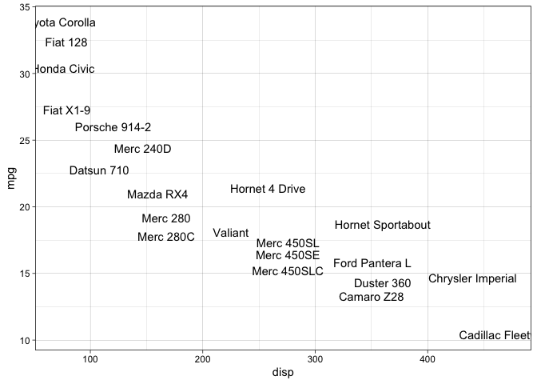
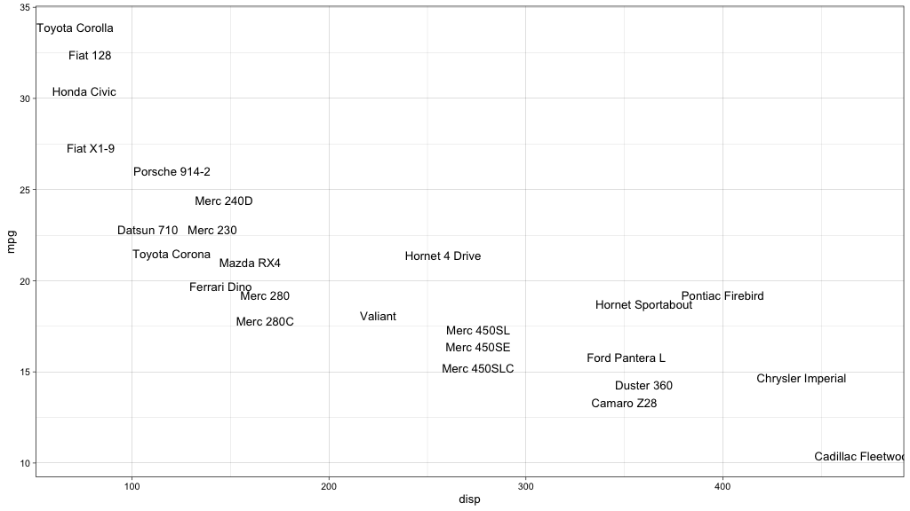
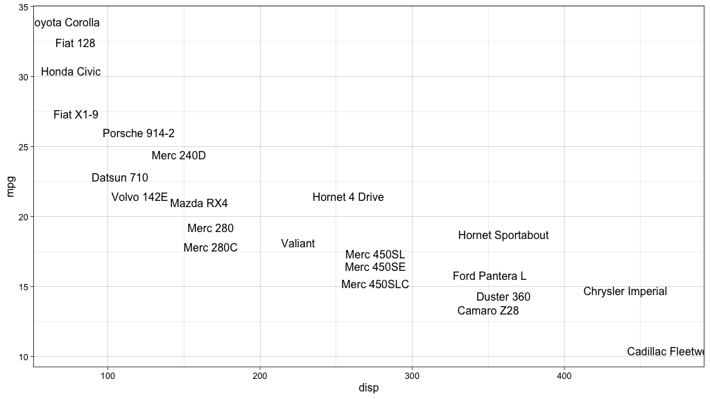
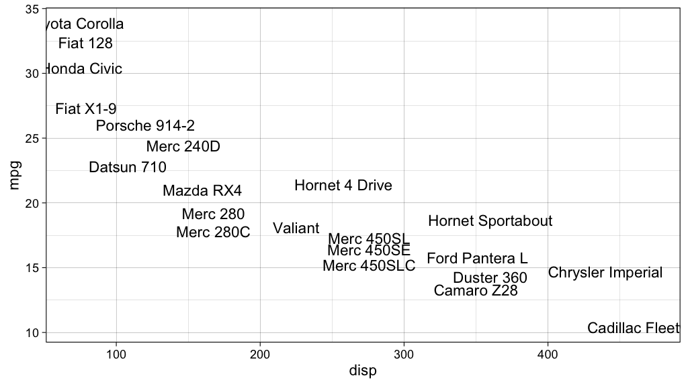

<!-- README.md is generated from README.Rmd. Please edit that file -->

# ggunit

<!-- badges: start -->

[](https://lifecycle.r-lib.org/articles/stages.html#experimental)
[](https://CRAN.R-project.org/package=ggunit)
<!-- badges: end -->

The goal of ggunit is to provide a consistent experience with `ggplot2`
sizes, proportions, and units. The package is for now simple, but with a
powerful philosophy that makes it easy to choose proportions and scaling
for your graphic.

## Installation

ggunit is not available on CRAN. You can install the development version
of ggunit from GitHub:

``` r
# install.packages("remotes")
remotes::install_github("charlie-gallagher/ggunit")
```

## Philosophy

The central philosophy of the ggunit package is that the unit “lines” is
the best design unit for data visualization proportions. One *line* is
the height of a line of body text, for example the axis text. Since a
primary goal of visualizations is to have readable text, lines are a
natural unit of measurement.

Technically, ggunit asks for the text size and assumes that’s the height
of 1 line. It doesn’t account for other factors like line spacing.

## Usage

The function `device_dimensions()` helps you find the height and width
(in inches) to pass to your graphics device.

It takes a height in lines of text, an aspect ratio, and the body text
size (in points) and generates the correct units (in inches, by default)
for height and width.

``` r
library(ggplot2)
library(ggunit)

dims <- device_dimensions(default_text = 11, 
                          height = 30, 
                          aspect_ratio = 16/9)

dims
#> $height
#> [1] 4.56621
#> 
#> $width
#> [1] 8.117707
```

The result is a list of length 2 with the requested dimensions. Text
will appear smaller as the value of `height` increases. See examples
below.

You can use the shortcut `ggunit_save()`, which is a thin wrapper around
`ggplot2::ggsave()`, to quickly iterate on graphic proportions.

``` r
library(ggplot2)
library(ggunit)

my_plot <- ggplot(mtcars, aes(x = disp, y = mpg)) + 
  geom_point() + 
  theme_linedraw(base_size = 11)
  

# OPTION 1: Generate units, pass to device function
dims <- device_dimensions(
  default_text = 11,
  height = 30,
  aspect_ratio = 16/9
)

ggsave(
  plot = my_plot,
  filename = "~/Desktop/my_plot.png",
  height = dims$height,
  width = dims$width,
  dpi = 200
)

  
# OPTION 2: Do it all in one fell swoop
ggunit_save(
  plot = my_plot,
  filename = "~/Desktop/my_plot.png",
  dpi = 200,
  default_text = 11,
  height = 30,
  aspect_ratio = 16/9
)
```

For designs that are constrained by physical dimensions, ggunit provides
a way to find the appropriate text size in points given physical
dimensions and a desired proportion in lines, through
`text_dimensions()`.

``` r
text_dimensions(
    height = 5.5,
    units = "in",
    lines = 30
)
#> [1] 13
```

The text size is rounded to the nearest point by default. You can turn
this off by setting the `round` argument to `FALSE`.

``` r
text_dimensions(
    height = 5.5,
    units = "in",
    lines = 30,
    round = FALSE
)
#> [1] 13.2495
```

### Other tools

Aligning text sizes in ggplot can be painful. The two main places you
see text sizes are in `geom_text()` for plotting text and
`element_text()` for adjusting theme elements.

The problem is that `geom_text` uses millimeters for the `size`
argument, and `element_text` uses points. The ggplot2 package provides
the `.pt` constant, which is the number of points in 1 mm.

ggunit generalizes this with the `mm()` function, which converts from
(almost) any unit available with `grid::unit()` to millimeters. The
default is “pt” since this is the main use case.

``` r
default_text <- 11               # Text size in points

default_text / ggplot2::.pt      # Converted to millimeters
#> [1] 3.866058
mm(default_text, "pt")           # Same, but more intuitive
#> [1] 3.866058
```

The typical use is to make sure plotted text is the same size as your
theme’s default text size.

``` r
default_size <- 11

ex_plot <- ggplot(mtcars, aes(x = disp, y = mpg)) + 
    geom_text(aes(label = row.names(mtcars)),
              # geom_text uses millimeters, so convert
              size = ggunit::mm(default_size),
              check_overlap = TRUE) + 
    # base_size is in points, so don't convert
    theme_linedraw(base_size = default_size)

ex_plot
```



There is also a `px()` function, which converts from some unit to
pixels, given some resolution (pixels per inch). This is very useful for
use with html content like `gt` tables, although the name is regrettably
(and temporarily) the same as `gt::px()`.

``` r
# What's a 12 pt font in pixels, assuming web resolution of 96?
px(x = 12, units = "pts", res = 96)
#> [1] 16
```

# Examples

In RMarkdown, my figures are set to a width of 100%, so my `fig.height`
and `fig.width` options defines the scale of the graphic.

Thus, I have a physical constraint (whatever I set `fig.height` and
`fig.width` to). So I can use `text_dimensions()` to find the
appropriate text size given my desired graphic height in lines.

Notice that I don’t have to change (a) the figure dimensions, or (b)
anything about the theme or the plotted text geom. The only thing I have
to change is the number of “lines” I want my graphic to be.

## 45 lines, 16:9 aspect ratio

``` r
# fig.height = 6, fig.width = (6 * 16 / 9)
default_size <- text_dimensions(height = 6, lines = 45)

ggplot(mtcars, aes(x = disp, y = mpg)) + 
    geom_text(aes(label = row.names(mtcars)),
              # geom_text uses millimeters, so convert
              size = mm(default_size),
              check_overlap = TRUE) + 
    # base_size is in points, so don't convert
    theme_linedraw(base_size = default_size)
```



## 35 lines, 16:9 aspect ratio

``` r
# fig.height = 6, fig.width = (6 * 16 / 9)
default_size <- text_dimensions(height = 6, lines = 35)

ex_plot <- ggplot(mtcars, aes(x = disp, y = mpg)) + 
    geom_text(aes(label = row.names(mtcars)),
              # geom_text uses millimeters, so convert
              size = mm(default_size),
              check_overlap = TRUE) + 
    # base_size is in points, so don't convert
    theme_linedraw(base_size = default_size)

ex_plot
```



## 25 lines, 16:9 aspect ratio

``` r
# fig.height = 6, fig.width = (6 * 16 / 9)
default_size <- text_dimensions(height = 6, lines = 25)

ex_plot <- ggplot(mtcars, aes(x = disp, y = mpg)) + 
    geom_text(aes(label = row.names(mtcars)),
              # geom_text uses millimeters, so convert
              size = mm(default_size),
              check_overlap = TRUE) + 
    # base_size is in points, so don't convert
    theme_linedraw(base_size = default_size)

ex_plot
```



------------------------------------------------------------------------

Charlie Gallagher, March 2022
